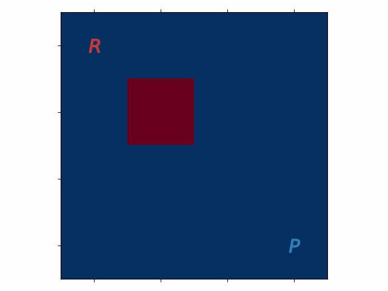

# Double-Agent SARSA Learning
Inspired by a lab in EL2805 Reinforcement Learning

## The Game
The robber *R* wants to rob the bank (red square). The police *P* tries to catch the robber.

Rules:
- The robber gets a reward of size 2 for each time step spent in the bank.
- The robber is punished with a reward of size -1 for each time step on the same square as the police.
- The police is punished with a reward of size -2 when the robber is in the bank.
- The police receives a reward of size 3 when being on the same square as the robber.

## SARSA
- The robber acts according to an epsilon-greedy policy with epsilon = 0.3, i.e. quite likely to try out "new" actions.
- The police acts according to an epsilon-greedy policy with epsilon = 0.05, i.e. will mostly use existing knowledge.

## Learned policies

### after 100000 time steps

### after 200000 time steps

### after 500000 time steps

### after 1000000 time steps

